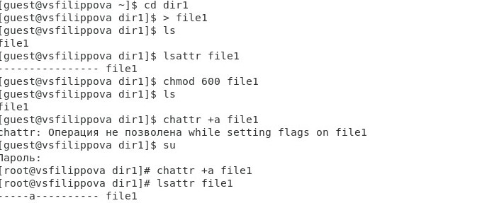
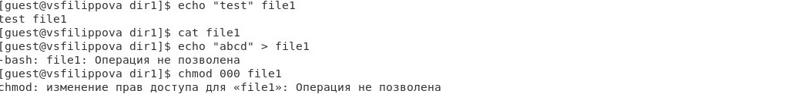
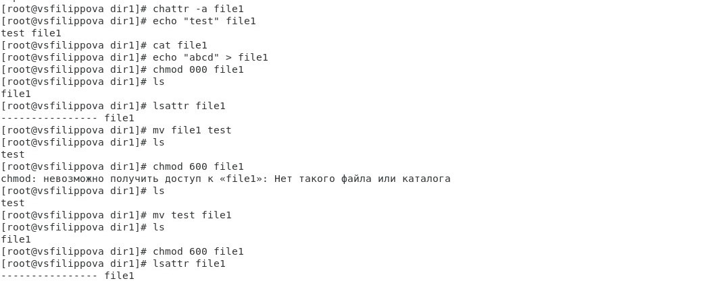
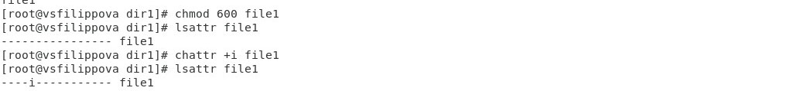
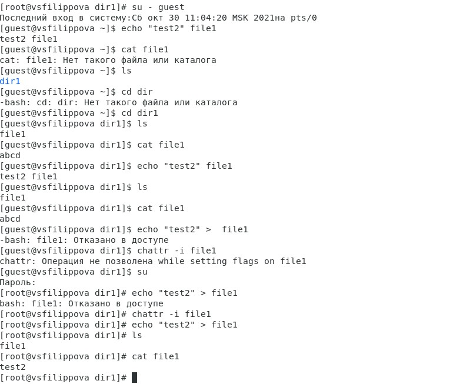

---
## Front matter
lang: ru-RU
title: Лабораторная работа №4
author: |
	Филиппова Вероника Сергеевна - студентка группы НКНбд-01-18
date: 30.10.2021

## Formatting
toc: false
slide_level: 2
theme: metropolis
header-includes:
 - \metroset{progressbar=frametitle,sectionpage=progressbar,numbering=fraction}
 - '\makeatletter'
 - '\beamer@ignorenonframefalse'
 - '\makeatother'
aspectratio: 43
section-titles: true
---
#  Дискреционное разграничение прав в Linux. Расширенные атрибуты

## Цель работы

Получение практических навыков работы в консоли с расширенными атрибутами файлов

## Задачи выполнения работы

1) Выполнить пункты
2) Создать от имени пользователя файл с расширенным атрибутом `a` и выполнить ряд операций
3) Заменить расширенный атрибут `a` на расширенный атрибут `i` и повторить все операции

## Результаты выполнения лабораторной работы. Часть 1

Установила на файл `/home/guest/dir1/file1` расширенный атрибут `a`.

{ #fig:003 width=70% }

## Результаты выполнения лабораторной работы. Часть 2

- Выполнила дозапись в файл `file1` слова «test». 
- Выполнила чтение файла `file1`
- Попробовала стереть имеющуюся в `file1` информацию.
- Попробовала установить на файл `file1` права, запрещающие чтение и запись для владельца файла.

{ #fig:005 width=70% }

## Результаты выполнения лабораторной работы. Часть 3

Сняла расширенный атрибут `a` с файла. Повторила операции, которые мне ранее не удавалось выполнить.

{ #fig:006 width=70% }

## Результаты выполнения лабораторной работы. Часть 4

Повторила мои действия по шагам, заменив атрибут `a` атрибутом `i`.

{ #fig:007 width=70% }

## Результаты выполнения лабораторной работы. Часть 5

Сняла расширенный атрибут `i` с файла `/home/guest/dirl/file1` от имени суперпользователя командой `chattr -i /home/guest/dir1/file1` и повторила операции, которые мне ранее не удавалось выполнить

{ #fig:008 width=70% }

# Выводы

Получила практические навыки работы в консоли с расширенными атрибутами файлов.