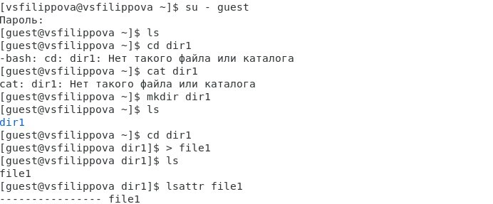
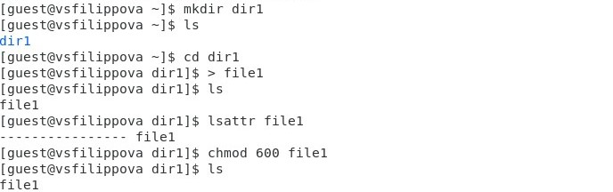
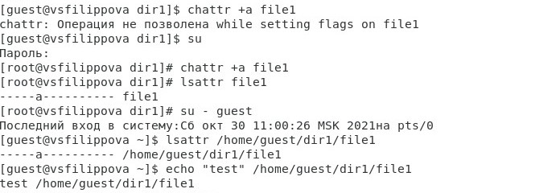
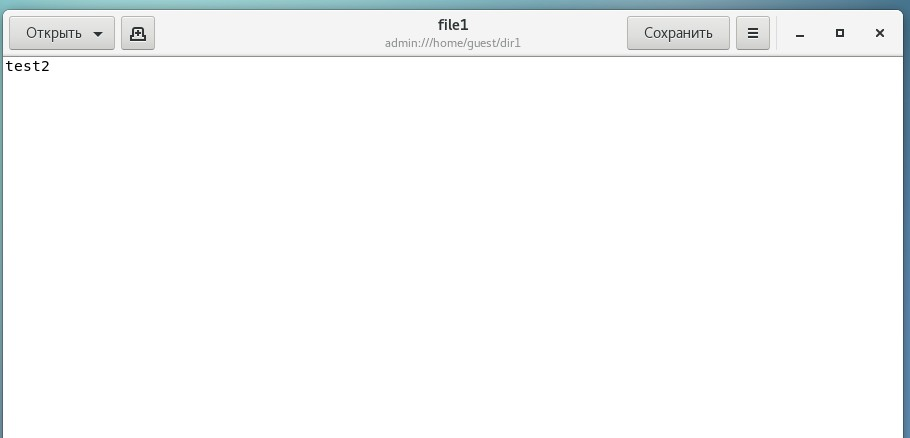

---
# Front matter
title: "Информационная безопасность."
subtitle: "Лабораторная работа №4."
author: "Филиппова Веорника Сергеевна."

# Generic otions
lang: ru-RU
toc-title: "Содержание"

# Bibliography

# Pdf output format
toc: true # Table of contents
toc_depth: 2
lof: true # List of figures
lot: true # List of tables
fontsize: 12pt
linestretch: 1.5
papersize: a4
documentclass: scrreprt
## I18n
polyglossia-lang:
  name: russian
  options:
  - spelling=modern
  - babelshorthands=true
polyglossia-otherlangs:
  name: english
### Fonts
mainfont: PT Serif
romanfont: PT Serif
sansfont: PT Sans
monofont: PT Mono
mainfontoptions: Ligatures=TeX
romanfontoptions: Ligatures=TeX
sansfontoptions: Ligatures=TeX,Scale=MatchLowercase
monofontoptions: Scale=MatchLowercase,Scale=0.9
## Biblatex
biblatex: true
biblio-style: "gost-numeric"
biblatexoptions:
  - parentracker=true
  - backend=biber
  - hyperref=auto
  - language=auto
  - autolang=other*
  - citestyle=gost-numeric
## Misc options
indent: true
header-includes:
  - \linepenalty=10 # the penalty added to the badness of each line within a paragraph (no associated penalty node) Increasing the value makes tex try to have fewer lines in the paragraph.
  - \interlinepenalty=0 # value of the penalty (node) added after each line of a paragraph.
  - \hyphenpenalty=50 # the penalty for line breaking at an automatically inserted hyphen
  - \exhyphenpenalty=50 # the penalty for line breaking at an explicit hyphen
  - \binoppenalty=700 # the penalty for breaking a line at a binary operator
  - \relpenalty=500 # the penalty for breaking a line at a relation
  - \clubpenalty=150 # extra penalty for breaking after first line of a paragraph
  - \widowpenalty=150 # extra penalty for breaking before last line of a paragraph
  - \displaywidowpenalty=50 # extra penalty for breaking before last line before a display math
  - \brokenpenalty=100 # extra penalty for page breaking after a hyphenated line
  - \predisplaypenalty=10000 # penalty for breaking before a display
  - \postdisplaypenalty=0 # penalty for breaking after a display
  - \floatingpenalty = 20000 # penalty for splitting an insertion (can only be split footnote in standard LaTeX)
  - \raggedbottom # or \flushbottom
  - \usepackage{float} # keep figures where there are in the text
  - \floatplacement{figure}{H} # keep figures where there are in the text
---

# Цель работы

Получение практических навыков работы в консоли с расширенными атрибутами файлов

# Задание

1) Выполнить пункты
2) Создать от имени пользователя файл с расширенным атрибутом `a` и выполнить ряд операций
3) Заменить расширенный атрибут `a` на расширенный атрибут `i` и повторить все операции

# Выполнение лабораторной работы

1. От имени пользователя guest определите расширенные атрибуты файла `/home/guest/dir1/file1` командой `lsattr /home/guest/dir1/file1`

{ #fig:001 width=70% }

2. Установите командой `chmod 600 file1` на файл file1 права, разрешающие чтение и запись для владельца файла

{ #fig:002 width=70% }

3. Попробовала установить на файл `/home/guest/dir1/file1` расширенный атрибут `a` от имени пользователя guest: `chattr +a /home/guest/dir1/file1`. В ответ получила отказ от выполнения операции

{ #fig:003 width=70% }

4. Повысила свои права с помощью команды `su`. Установила расширенный атрибут `a` на файл `/home/guest/dir1/file1` от имени суперпользователя: `chattr +a /home/guest/dir1/file1`

5. От пользователя `guest` проверила правильность установления атрибута:`lsattr /home/guest/dir1/file1`

{ #fig:004 width=70% }

6. Выполнила дозапись в файл `file1` слова «test» командой `echo "test" /home/guest/dir1/file1`. После этого выполнила чтение файла `file1` командой `cat /home/guest/dir1/file1`

7. Попробовала стереть имеющуюся в `file1` информацию командой `echo "abcd" > /home/guest/dirl/file1`. Не получилось.

8. Попробовала с помощью команды `chmod 000 file1` установить на файл `file1` права, например, запрещающие чтение и запись для владельца файла. Не получилось.

{ #fig:005 width=70% }

9. Сняла расширенный атрибут `a` с файла `/home/guest/dirl/file1` от имени суперпользователя командой `chattr -a /home/guest/dir1/file1`. Повторила операции, которые мне ранее не удавалось выполнить. Мне удалось дозаписать и перезаписать файл, переименование файла тоже прошло успешно 

{ #fig:006 width=70% }

10. Повторила мои действия по шагам, заменив атрибут `a` атрибутом `i`.
- Снова установила командой `chmod 600 file1` на файл `file1` права, разрешающие чтение и запись для владельца файла. 
- Установила расширенный атрибут `i` на файл `/home/guest/dir1/file1` от имени суперпользователя: `chattr +i /home/guest/dir1/file1`. 
- От пользователя `guest` проверила правильность установления атрибута: `lsattr /home/guest/dir1/file1`.
- Выполнила дозапись в файл `file1` слова «test» командой `echo "test" /home/guest/dir1/file1`. 
- Попробовала удалить файл `file1` либо стереть имеющуюся в нём информацию командой `echo "abcd" > /home/guest/dirl/file1`. Получила отказ в доступе. 
- Сняла расширенный атрибут `i` с файла `/home/guest/dirl/file1` от имени суперпользователя командой `chattr -i /home/guest/dir1/file1` и повторила операции, которые мне ранее не удавалось выполнить

{ #fig:007 width=70% }
{ #fig:008 width=70% }
{ #fig:009 width=70% }

# Выводы

Получила практические навыки работы в консоли с расширенными атрибутами файлов.